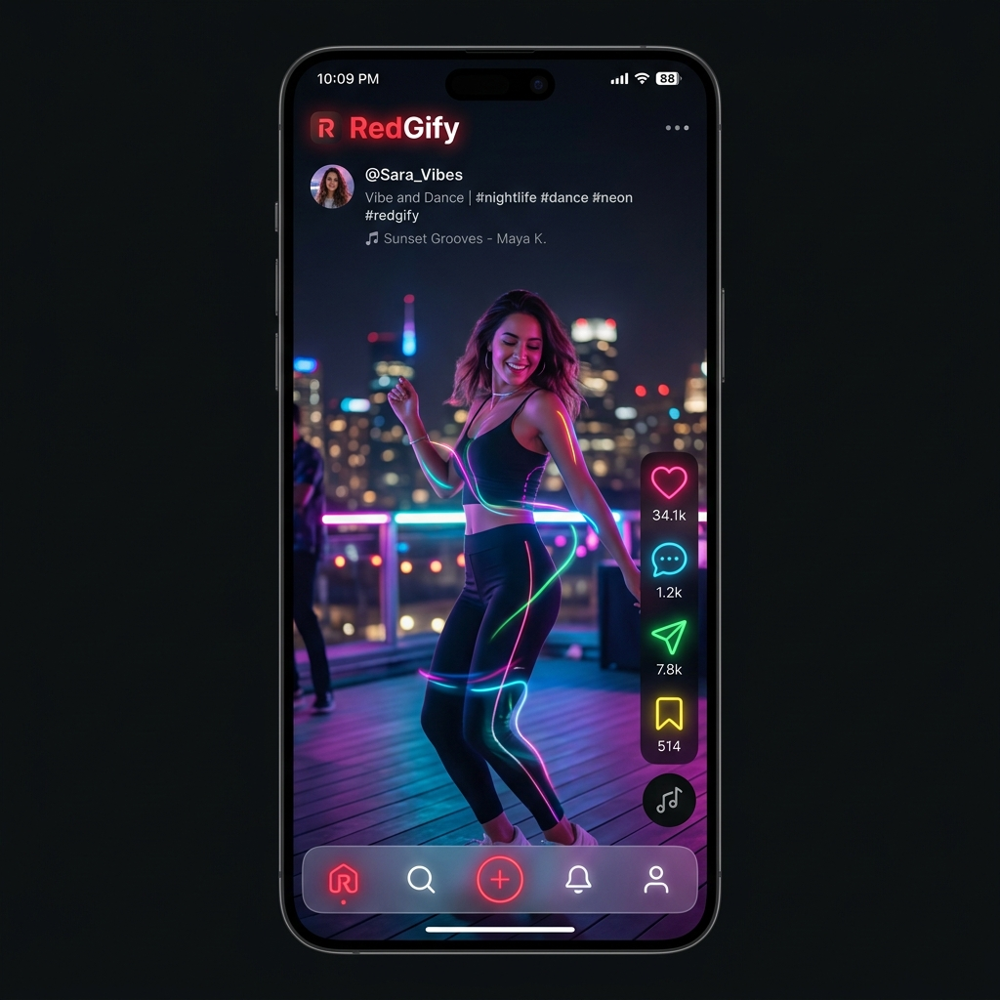
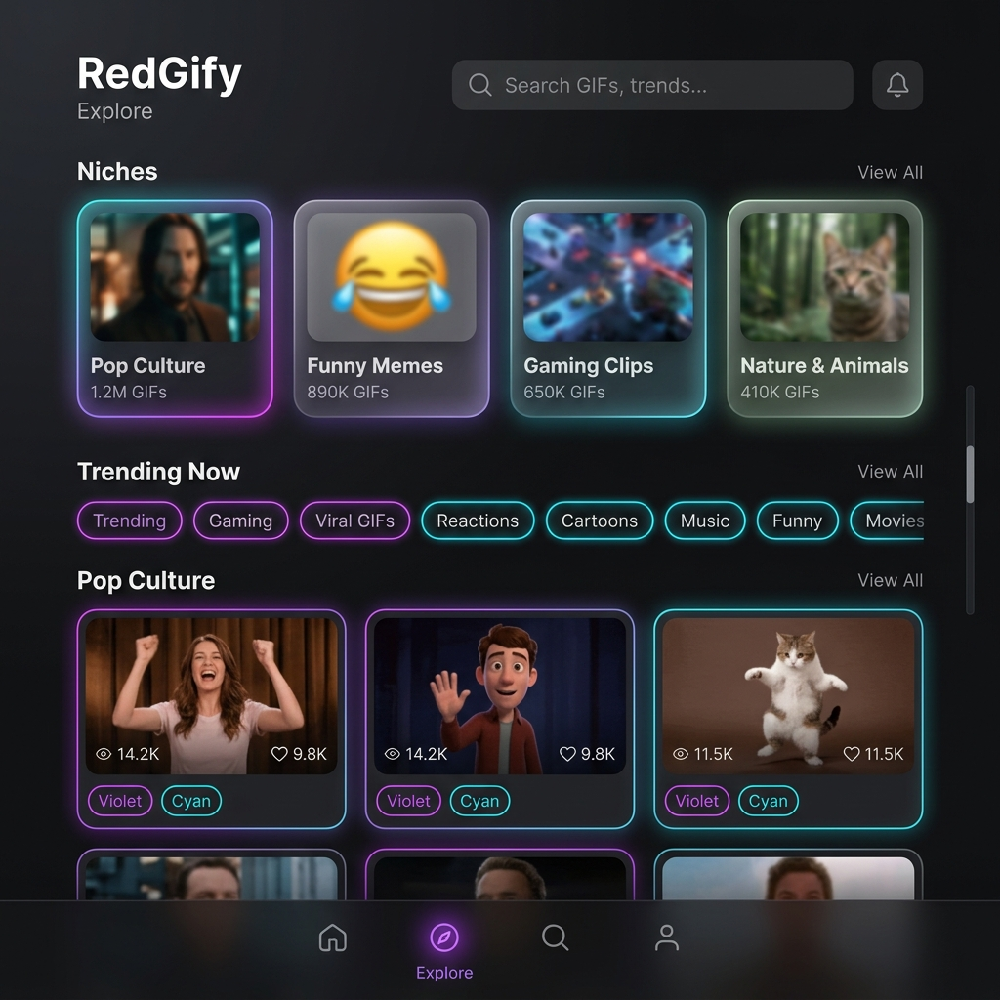
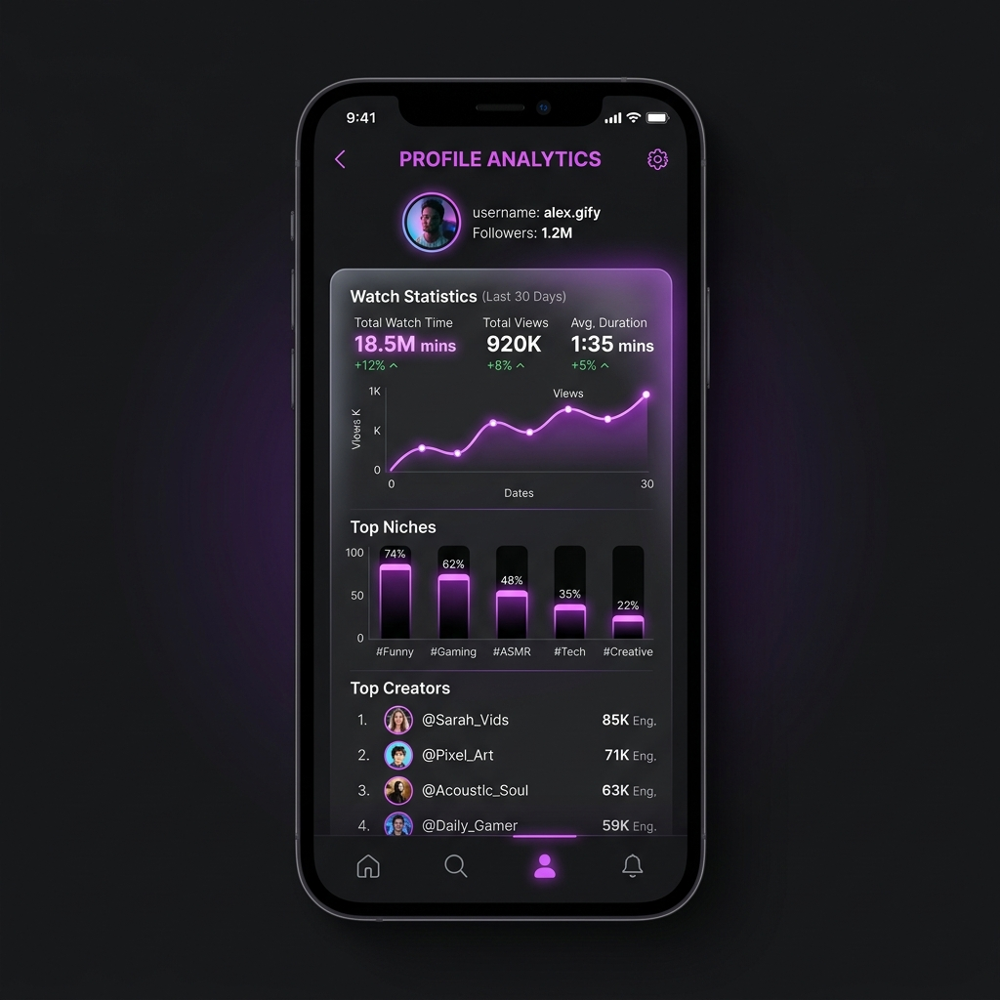
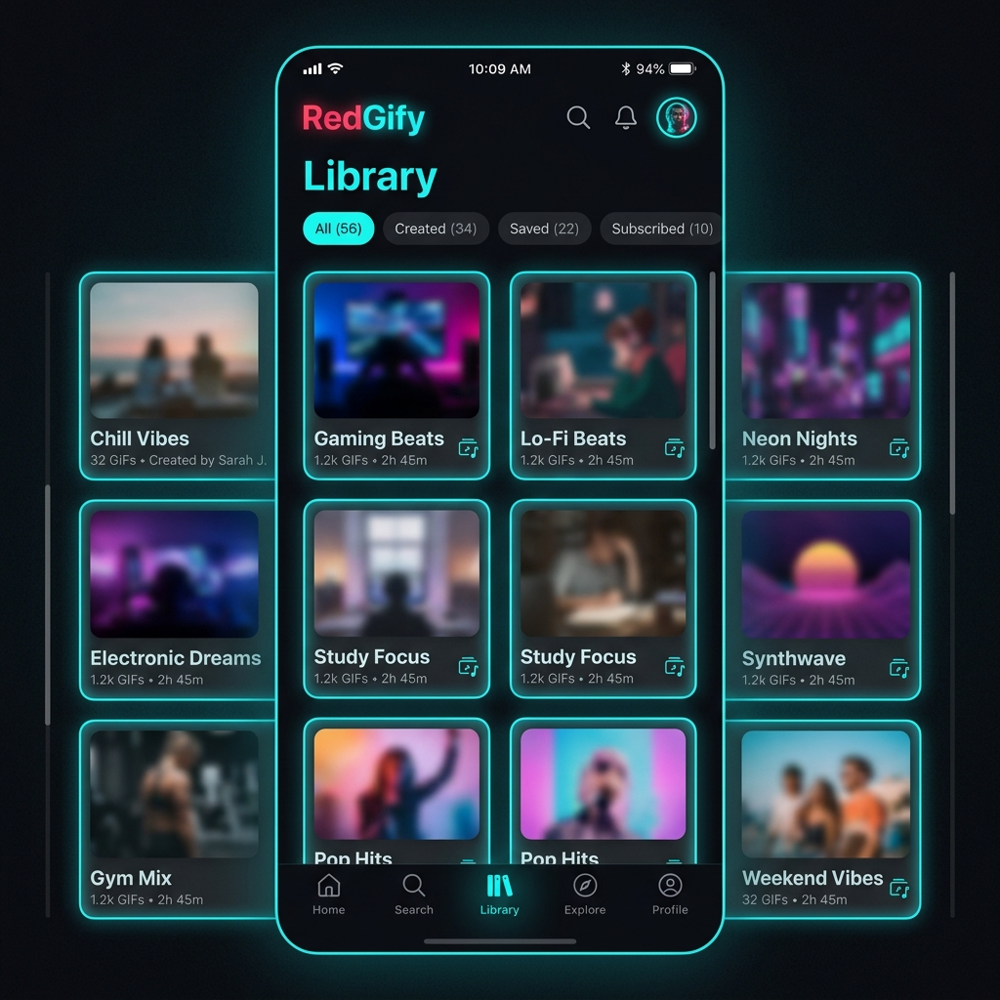

# RedGify 🎬

RedGify is a premium, state-of-the-art Flutter mobile application designed for browsing, streaming, and managing high-quality GIF streams, static images, and short-form videos. Built with a high-fidelity **glassmorphic & frosted glass design system**, RedGify features vibrant neon glows, thin sleek borders, and interactive micro-animations. It dynamically adapts between dark and light modes, creating an immersive, premium viewing experience.

---

## 📸 App Showcase

Here is a visual overview of RedGify's clean, minimalist layout and features:

| 📱 Reels Player UI | 🔍 Explore Hub |
| :---: | :---: |
|  |  |

| 📊 Me Profile Analytics | 📂 Library & Playlists |
| :---: | :---: |
|  |  |

---

## ✨ Features Checklist

### 1. Vertical Reels-Style Player UI
* **Vertical Swipe Navigation**: Immersive full-screen reels player using a vertical `PageView` controller, automatically recycling and disposing controllers to minimize memory consumption.
* **Smart Multi-Gesture Interceptor**:
  * **Left 1/3 Zone**: Tap and hold to seek backward (rewind) by 1-second intervals with glowing indicators.
  * **Right 1/3 Zone**: Tap and hold to seek forward by 1-second intervals with glowing indicators.
  * **Middle 1/3 Zone**: Hold to accelerate video playback to `2.0x` speed with visual HUD confirmation.
  * **Double Tap**: Toggles play/pause state instantly with a glowing fade animation.
* **Custom Neon Controls**: Compact control bar featuring custom-drawn vector icons (hot pink heart for favoriting, violet playlist adder, cyan downloader, and node share icon) wrapped in glassmorphic borders.
* **Glassmorphic bottom seekbar**: Fluid scrubbing bar with real-time video preview.

### 2. Tabbed Explore & Search Hub
* **Unified Explore Hub**: Includes 5 tabbed sections wrapped in a glassmorphic blurred header:
  * **Gif**: Trending and sorted GIF streams.
  * **Images**: Renders static image files with a blurred backdrop preview, bypassing the video decoder.
  * **Creator**: Trending creators index.
  * **Niche**: Hot, Latest, and Top categories.
  * **Tags**: Trending search tags.
* **Flexible Sorting Filters**:
  * *Gif, Images, & Creators*: Sort by **Trending**, **Top of Week**, **Top of Month**, and **Latest**.
  * *Niche*: Sort by **Hot**, **Latest**, and **Top**.
* **Glassmorphic Search Dialog**: A floating header and search button in the bottom navigation bar trigger a frosted bottom sheet that slides up, autofocuses, and directs submissions to the home feed.

### 3. Personal Analytics & "Me" Profile
* **Aggregate Statistics Engine**: Analyzes your local offline watch history database in real-time.
* **Ranked Top Listings**: Computes and displays your **Top 10 Niches**, **Top 10 Tags**, and **Top 10 Creators** by view counts.
* **Interactive Navigation**: Tap any entry in your stats to instantly view tag results, creator profiles, or pre-filter niches in the Explore screen.
* **Detail Sheets**: Click "See All" on any category to open sliding frosted glass detail sheets showing complete aggregated lists.

### 4. Playlists, Favorites, & Categories
* **Local Playlists**: Create, rename, delete, and manage custom playlists persisted locally.
* **Categorized Favorites**: Organize favorited items into custom folders/tags.
* **Category Filters**: Filter favorites seamlessly in the Library using a horizontal scrolling chip bar.

### 5. Bulk Action Queue & Selection Mode
* **Multi-Select Overlays**: Activated via long-press on any card, turning tapping gestures into check/uncheck indicators.
* **Floating Bulk Action Bar**: Perform bulk actions on selected items at once:
  * Bulk favorite/unfavorite.
  * Bulk add to a selected playlist or create a new playlist.
  * Bulk background downloads.

### 6. Downloader Manager & File Transfer
* **Download Service**: High-speed chunk-based streaming to download MP4 files.
* **Live Progress Feedback**: Displays circular percentage indicators on active buttons and progress bars in the bulk action queue.
* **Public Directory Savings**: Configured to save media inside `/storage/emulated/0/Download/RedGify/` rather than internal sandbox storage for easy file sharing.
* **Import & Export Backups**: Backup playlists, favorites, custom categories, and watch history to a versioned JSON file and share/restore via `file_picker`.

### 7. Performance & Offline Engine
* **Isar NoSQL Database**: Ultra-fast local database caching with string-hashing schemas.
* **Rate-Limit Safeguards**: Caches temporary JWT authentication tokens to prevent `429 Too Many Requests` API locks.
* **Smart Cache Expiry**: Employs cache invalidation prefixes to selectively delete cached paginated streams when triggering a pull-to-refresh.
* **Watched Exclusions**: Option to exclude watched media from feeds to guarantee a fresh, unseen queue on scroll.

---

## 🎨 Theme & Styling Architecture

RedGify implements a customized dynamic theme system:
* **GlassyContainer**: A core reusable widget blending `BackdropFilter` (sigma 15) frosted blurs, subtle glowing shadows (`AppTheme.cardGlow`), and thin border accents (`AppTheme.border`).
* **Vibrant Contrast**: Dark Mode uses glowing neon outlines (hot pink, purple, cyan), while Light Mode softens the neon outlines to clean, translucent borders for maximum legibility.
* **Dynamic Typography**: Integrated Google Fonts (Outfit for headers, Inter for reading text) dynamically adjusting colors based on the active Theme Mode.

---

## 🛠️ Build and Setup

### Prerequisites
* Flutter SDK (3.11.x or higher)
* Android Studio / Gradle environment

### Steps
1. **Clone the Repository**:
   ```bash
   git clone https://github.com/ifritraen/RedGify.git
   cd RedGify
   ```
2. **Install Dependencies**:
   ```bash
   flutter pub get
   ```
3. **Run Code Generator** (for Isar database schemas):
   ```bash
   dart run build_runner build --delete-conflicting-outputs
   ```
4. **Generate Launcher Icons**:
   ```bash
   dart run flutter_launcher_icons
   ```
5. **Run the Application**:
   ```bash
   flutter run
   ```
6. **Compile optimized Release APKs**:
   ```bash
   flutter build apk --split-per-abi
   ```
